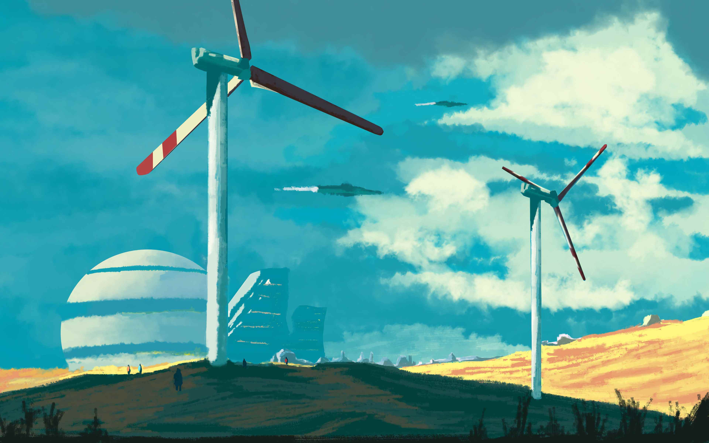

    <h1>WTM Wind Turbine Maintenance</h1>

    <picture style="display: block; margin: 0 auto; max-width: 100%;">
        

---

    <h1>🌟 Технологический стек</h1>

### 🖥 Веб-часть  
| Компонент | Технология | Назначение |
|-----------|------------|------------|
| Backend | Python FastAPI | REST API для управления системой |
| Frontend | Electron, React TypeScript, tailwindcss | Десктопный интерфейс |

### 🛰 Основные модули  
| Модуль | Технологии | Описание |  
|--------|------------|----------|  
| `routing/` | ACO, GA | Оптимизация маршрутов |  
| `defect_detection/` | YOLOv8, ResNet | Детекция дефектов |  
| `api/` | Python FastAPI | 
| `simulation/` | ? | 

---

    <h1>🚀 Быстрый старт</h1>

  
----------
    git clone -b wind_turbine https://codeberg.org/user00101/Grant-temp.git

Dev frontend

    cd Grant-temp
    npm install
    
    cd electron/
    npm install
    
    cd ../renderer
    npm install
    
    cd ..
    npm start

Dev backend

    cd Grant-temp

    pip install -r requirements.txt

    cd server/src

    uvicorn api.main:app --port 8000
----------

---

---

    <h1>📂 Архитектура системы </h1>

----------
    .
    ├── electron
    │   ├── common
    │   │   └── electron-commands.ts
    │   ├── dist
    │   │   ├── common
    │   │   │   ├── electron-commands.js
    │   │   │   └── electron-commands.js.map
    │   │   ├── index.js
    │   │   ├── index.js.map
    │   │   ├── main-window.js
    │   │   ├── main-window.js.map
    │   │   ├── preload.js
    │   │   ├── preload.js.map
    │   │   └── utils
    │   │       ├── get-device-specs.js
    │   │       ├── get-device-specs.js.map
    │   │       ├── local-storage.js
    │   │       ├── local-storage.js.map
    │   │       ├── logit.js
    │   │       ├── logit.js.map
    │   │       ├── show-notification.js
    │   │       ├── show-notification.js.map
    │   │       ├── slash.js
    │   │       └── slash.js.map
    │   ├── forge.config.js
    │   ├── index.ts
    │   ├── main-window.ts
    │   ├── package.json
    │   ├── package-lock.json
    │   ├── preload.ts
    │   ├── tsconfig.json
    │   └── utils
    │       ├── get-device-specs.ts
    │       ├── local-storage.ts
    │       ├── logit.ts
    │       ├── show-notification.ts
    │       └── slash.ts
    ├── package.json
    ├── package-lock.json
    ├── README.md
    ├── renderer
    │   ├── components
    │   │   └── NavBar.tsx
    │   ├── fonts
    │   │   └── poppins
    │   │       ├── Poppins-Black.ttf
    │   │       ├── Poppins-Bold.ttf
    │   │       ├── Poppins-ExtraBold.ttf
    │   │       ├── Poppins-Medium.ttf
    │   │       ├── Poppins-Regular.ttf
    │   │       └── Poppins-SemiBold.ttf
    │   ├── images
    │   │   ├── docs
    │   │   │   └── docs.jpg
    │   │   ├── history
    │   │   │   └── hist.jpg
    │   │   ├── home
    │   │   │   └── windturbines.jpg
    │   │   ├── readme
    │   │   │   └── drone.png
    │   │   ├── router
    │   │   │   ├── art.jpg
    │   │   │   ├── map-placeholder1.png
    │   │   │   ├── map-placeholder2.png
    │   │   │   ├── map-placeholder.png
    │   │   │   └── picture.jpg
    │   │   └── weather
    │   │       ├── back.jpg
    │   │       ├── Clear.svg
    │   │       ├── Clouds.svg
    │   │       ├── Cloud-wind.svg
    │   │       ├── Drizzle.svg
    │   │       ├── Moon.svg
    │   │       ├── Night-rainy.svg
    │   │       ├── Night.svg
    │   │       ├── Preview.svg
    │   │       ├── Rain.svg
    │   │       ├── Snow.svg
    │   │       ├── Thunderstorm.svg
    │   │       └── Tonado.svg
    │   ├── index.html
    │   ├── main.tsx
    │   ├── package.json
    │   ├── package-lock.json
    │   ├── pages
    │   │   ├── App.tsx
    │   │   ├── Docs.tsx
    │   │   ├── History.tsx
    │   │   ├── Home.tsx
    │   │   ├── Router.tsx
    │   │   └── Weather.tsx
    │   ├── postcss.config.js
    │   ├── styles
    │   │   └── globals.css
    │   ├── tailwind.config.js
    │   ├── tsconfig.json
    │   ├── tsconfig.node.json
    │   └── vite.config.ts
    ├── server
    │   ├── assets
    │   │   └── configs
    │   │       └── database.ini
    │   ├── database-backup
    │   │   ├── wind_db_back.sql
    │   │   └── winddb.png
    │   ├── docs
    │   │   ├── api.md
    │   │   ├── architecture.md
    │   │   └── user_manual.md
    │   ├── requirements.txt
    │   └── src
    │       ├── api
    │       │   ├── database
    │       │   │   ├── config.py
    │       │   │   └── databaseconn.py
    │       │   ├── logs
    │       │   │   └── router_pipeline.log
    │       │   ├── main.py
    │       │   ├── modules
    │       │   │   ├── __pycache__
    │       │   │   │   ├── routerModule.cpython-312.pyc
    │       │   │   │   └── weatherModule.cpython-312.pyc
    │       │   │   ├── routerModule.py
    │       │   │   └── weatherModule.py
    │       │   ├── __pycache__
    │       │   │   └── main.cpython-312.pyc
    │       │   ├── routes
    │       │   │   ├── __pycache__
    │       │   │   │   └── router.cpython-312.pyc
    │       │   │   └── router.py
    │       │   └── service
    │       │       ├── __pycache__
    │       │       │   ├── routerService.cpython-312.pyc
    │       │       │   └── weatherService.cpython-312.pyc
    │       │       ├── routerService.py
    │       │       └── weatherService.py
    │       ├── data_processing
    │       │   ├── annotation.py
    │       │   ├── sensor_processor.py
    │       │   └── video_processor.py
    │       ├── defect_detection
    │       │   ├── data
    │       │   │   ├── best_turbine.pt
    │       │   │   ├── input_folder
    │       │   │   │   ├── 144_2048_3584_640_640_0_8192_5460_JPG_jpg.rf.4cb73c27668059fafb823f517eb74925.jpg
    │       │   │   │   ├── 312_1653_3072_1536_640_640_0_8192_5460_jpg.rf.c3587aa4eced3bdc75a4e94761cd9d9f.jpg
    │       │   │   │   ├── 37_jpg.rf.b6a3c0348bc1df9472df2b4418c5208c.jpg
    │       │   │   │   ├── 40_1801_3072_2048_640_640_0_5184_3888_jpg.rf.f93bca46b3005dd612c27e1d3b240a9e.jpg
    │       │   │   │   └── 47_512_3584_640_640_0_8192_5460_JPG_jpg.rf.a1304c56eccf8f2bd6d072de875ffd12.jpg
    │       │   │   ├── output_folder
    │       │   │   │   ├── 144_2048_3584_640_640_0_8192_5460_JPG_jpg.rf.4cb73c27668059fafb823f517eb74925.jpg
    │       │   │   │   ├── 312_1653_3072_1536_640_640_0_8192_5460_jpg.rf.c3587aa4eced3bdc75a4e94761cd9d9f.jpg
    │       │   │   │   ├── 37_jpg.rf.b6a3c0348bc1df9472df2b4418c5208c.jpg
    │       │   │   │   ├── 40_1801_3072_2048_640_640_0_5184_3888_jpg.rf.f93bca46b3005dd612c27e1d3b240a9e.jpg
    │       │   │   │   └── 47_512_3584_640_640_0_8192_5460_JPG_jpg.rf.a1304c56eccf8f2bd6d072de875ffd12.jpg
    │       │   │   ├── YOLO11_Scan.ipynb
    │       │   │   └── yolo11_scan.py
    │       │   ├── mask_rcnn.py
    │       │   ├── resnet_classifier.py
    │       │   └── yolo_detector.py
    │       ├── failure_prediction
    │       │   ├── deepsurv_model.py
    │       │   ├── gru_model.py
    │       │   └── prediction_manager.py
    │       ├── routing
    │       │   ├── aco_optimizer.py
    │       │   ├── coordinates_parse_kml.py
    │       │   ├── ga_optimizer.py
    │       │   ├── __pycache__
    │       │   │   ├── aco_optimizer.cpython-311.pyc
    │       │   │   ├── aco_optimizer.cpython-312.pyc
    │       │   │   ├── coordinates_parse_kml.cpython-311.pyc
    │       │   │   ├── coordinates_parse_kml.cpython-312.pyc
    │       │   │   ├── ga_optimizer.cpython-312.pyc
    │       │   │   └── route_manager.cpython-312.pyc
    │       │   └── route_manager.py
    │       ├── simulation
    │       │   ├── unreal_bridge.cpp
    │       │   ├── unreal_bridge.py
    │       │   └── visualization.py
    │       ├── uploads
    │       │   ├── 19810042-5b4f-4535-aec9-16d6e06c3cc7_48.221051lo40.301775.kml
    │       │   ├── 2851b8e0-17bc-4a73-b0f6-b44b4d609149_Untitled project(2).kml
    │       │   ├── 4120fdd2-fa55-42cf-94fc-2d18ef1bf31b_Untitled project.kml
    │       │   ├── 7a035f78-7ead-44da-bd74-70e33fde43b9_Untitled project(1).kml
    │       │   ├── 8bb35937-af14-4caa-8e70-6ed393d255d8_Untitled_project.kml
    │       │   └── a929d204-a382-4201-8236-bc93d4afa03c_Untitled project(3).kml
    │       └── weather
    │           ├── data_parse.py
    │           ├── __pycache__
    │           │   ├── data_parse.cpython-311.pyc
    │           │   ├── data_parse.cpython-312.pyc
    │           │   ├── weather_api.cpython-311.pyc
    │           │   └── weather_api.cpython-312.pyc
    │           └── weather_api.py
    └──

    48 directories, 148 files

----------

    <h1>📄 Документация</h1>

- [API Reference](docs/api.md)  
- [Руководство пользователя](docs/user_manual.md)  

---

    <h1>🤝 Участие в разработке</h1>

Приветствуются:  
- 🐛 Отчеты об ошибках в Issues  
- 💡 Pull Request'ы с улучшениями  
- 📚 Перевод документации  